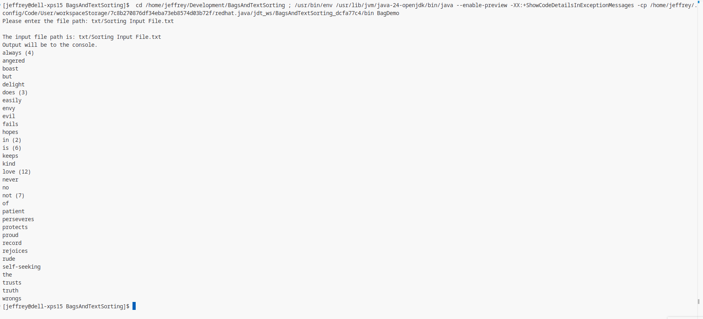

# BagDemo

## Overview

**BagDemo** is a Java program that reads a text file, extracts all words, and displays them in alphabetical order along with their occurrence count (if greater than one). This is sometimes called a "bag" or multiset. The program strips all leading and trailing punctuation from words and applies specific capitalization rules for display.

## How the Original Example Worked

The original `BagDemo.java` provided by the instructor included:

- **Input/Output Handling:**  
  - If no command-line arguments are given, prompts the user for an input file and outputs to the console.
  - If one argument is given, uses it as the input file and generates the output file name by replacing the extension with `.out`.
  - If two arguments are given, uses them as input and output file names.
- **Utility Method:**  
  - `fixExtension(String s)`: Replaces the file extension with `.out`.
- **Scaffolding:**  
  - The original code provided the structure for handling input and output, but did not implement the logic for reading, counting, or sorting words, nor any word processing or output formatting.

## What is Changed and How the Custom Implementation Works

Logic required by the assignment:

- **Word Extraction and Normalization**
  - Reads each word from the input file.
  - Strips leading and trailing punctuation using regular expressions.
  - Tracks the original casing of each word to determine display capitalization.

- **Counting Occurrences**
  - Counts each unique word (case-sensitive) using a `HashMap`.

- **Capitalization Rules**
  - If a word always appears capitalized and never in lowercase, it is displayed with an initial capital letter (using own `capitalize()` method).
  - Otherwise, it is displayed in all lowercase.

- **Sorting and Display**
  - Outputs words in lexicographical (alphabetical) order.
  - If two words are identical except for case, the capitalized version appears first.
  - If a word occurs more than once, its count is shown in parentheses.

- **Flexible Input/Output**
  - Supports all modes described in the assignment: prompt for input file, use command-line arguments for input/output, and auto-generate output file names.

## Example

Given the input file:

```
This is a sentence that has a couple of duplicate words, like “this.”
```

The output will be:

```
a (2)
couple
duplicate
has
is
like
of
sentence
that
this (2)
words
```

Given the input:

```
John is knocking; John is here!
```

The output will be:

```
here
is (2)
John (2)
knocking
```



## How to Run

1. **Compile:**
   ```
   javac BagDemo.java
   ```

2. **Run:**
   - **No arguments:**  
     Prompts for input file, outputs to console.
     ```
     java BagDemo
     ```
   - **One argument:**  
     Uses argument as input file, outputs to `[inputname].out`.
     ```
     java BagDemo input.txt
     ```
   - **Two arguments:**  
     Uses first as input file, second as output file.
     ```
     java BagDemo input.txt output.txt
     ```

## Notes

- The program is robust and can handle both small and large text files (e.g., "Alice in Wonderland", "Moby-Dick").
- All requirements from the assignment prompt are implemented, including punctuation stripping, capitalization rules, and output formatting.
- All word processing, counting, and formatting logic was implemented according to specifications.

## How the BagDemoTest Tester Works

The `BagDemoTest.java` file is an automated tester for the `BagDemo` program. It verifies that `BagDemo` correctly implements all required functionality and matches the assignment specification.

### What It Tests

For each test file and target word, the tester checks all three modes of `BagDemo`:
1. **Prompt Mode:** Simulates running `BagDemo` with no arguments and entering the filename at the prompt.
2. **One-Argument Mode:** Runs `BagDemo` with the input filename as a command-line argument, expecting output in a `.out` file.
3. **Two-Argument Mode:** Runs `BagDemo` with both input and output filenames as arguments.

For each mode, the tester:
- Runs `BagDemo` and captures its output.
- Computes the expected output line for the target word, using the same normalization and capitalization rules as the assignment.
- Searches the output for the expected line and reports PASS or FAIL.

### How It Determines the Expected Output

The tester:
- Reads the input file and strips all leading/trailing punctuation and whitespace from each word.
- Counts all case-insensitive occurrences of the target word.
- Applies the assignment's capitalization rules: the word is capitalized only if every occurrence is capitalized and never lowercase.
- Formats the output as required (e.g., `love (12)` if the word appears 12 times).

### Test Results

After running all tests, the tester prints a summary showing:
- The number of test cases passed and failed.
- Details for any failed tests, including the expected and actual output.

### Zipfian Distribution Test
- Further verifies correctness of BagDemo.java by testing it against Zipf's Law and by doing a Kolmogorov-Smirnov test.
- In short, we want the distribution of a list sorted from most frequent artifact to least frequent artifact to have a slope of around -1 when it comes to language.
- Alice in Wonderland and Moby Dick's BagDemo outputs are both tested using these means to verify BagDemo counts the occurance of words in accordance with rates we would statistically expect.
- See [this Wikipedia article](https://en.wikipedia.org/wiki/Zipf%27s_law#Empirical_testing) for further information.

### How to Add More Tests

- To add more test cases, simply add more entries to the `tests` array in `BagDemoTest.java`, specifying the input file and the word you want to check.
- The Zipfian tests are handled separately, as a Zipf analysis of shorter texts isn't so useful.
